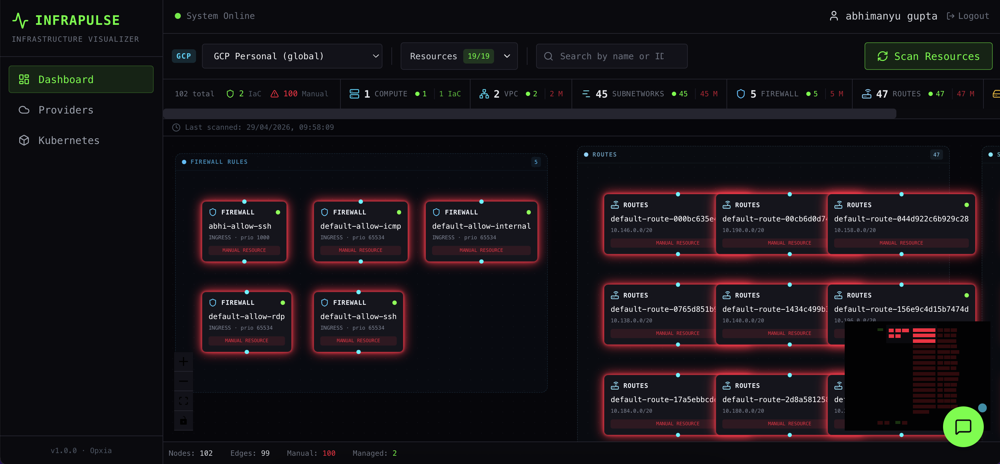

<p align="center">
  
</p>

# InfraPulse

InfraPulse is a full-stack infrastructure visibility application for connecting cloud and Kubernetes environments, discovering resources, and exploring them as interactive dependency graphs.

## What It Does

- Connect AWS accounts using access keys or temporary session credentials.
- Connect GCP projects using service account credentials.
- Connect Azure subscriptions using service principal credentials.
- Connect Kubernetes clusters such as ROSA, EKS, GKE, and AKS.
- Discover supported infrastructure resources and visualize relationships as graphs.
- Cache scanned infrastructure data locally.
- Inspect graph nodes, Kubernetes deployment details, and pod logs.
- Ask AI-assisted questions over scanned AWS infrastructure metadata.
- Authenticate users with local email/password login, with optional Google OAuth.

## Supported Resources

### AWS

- Compute: EC2, Lambda
- Database and cache: RDS, ElastiCache
- Storage: S3
- Networking: VPC, Subnet, Route Table, Transit Gateway, VPC Endpoint, Internet Gateway, NAT Gateway, Elastic IP, DHCP Options, Network ACL, VPN, ELB
- Security: Secrets Manager, KMS, ACM, WAF
- Content and API: CloudFront, API Gateway, Route 53
- Messaging: SNS, SES

### GCP

- Compute: Compute Engine VMs, Cloud Functions, Cloud Run
- Networking: VPC Networks, Subnetworks, Firewall Rules, Routes, Cloud Routers, Cloud NAT, External IPs
- Database and cache: Cloud SQL, Memorystore Redis
- Storage: Cloud Storage
- Security: KMS Keys, Secret Manager, Cloud Armor
- Content and API: Load Balancers, Cloud DNS
- Messaging: Pub/Sub Topics

### Azure

- Compute: Virtual Machines, Function Apps, App Services
- Networking: Virtual Networks, Subnets, Network Security Groups, Public IPs, Load Balancers, Application Gateways
- Database and cache: SQL Servers, Azure Cache for Redis
- Storage: Storage Accounts
- Security: Key Vaults
- Content and API: DNS Zones
- Messaging: Service Bus Namespaces

### Kubernetes

- ROSA
- Amazon EKS
- Google GKE
- Azure AKS
- Deployments
- StatefulSets
- DaemonSets
- Pods
- Jobs
- CronJobs
- Services
- Ingresses
- Secrets
- ConfigMaps
- PersistentVolumeClaims
- Cluster Nodes

## Tech Stack

- Frontend: React, Vite, TypeScript, Tailwind CSS, React Flow
- Backend: Node.js, Express, TypeScript, Passport.js, Socket.IO
- Cloud SDKs: AWS SDK v3, Kubernetes client
- Database: SQLite with SQL migrations
- AI integration: Globant SAIA chat API

## Prerequisites

- Node.js `>=20.19.0 <23`
- npm
- AWS credentials with read permissions for the resources you want to scan
- GCP service account credentials with read permissions for the resources you want to scan
- Azure service principal credentials with Reader access to the target subscription or resource group
- Kubernetes API server URL and bearer token for direct ROSA-style cluster connections
- Optional: Google OAuth credentials for Google login
- Optional: Globant SAIA API key for AI chat

Node 22 is recommended for local development.

## Getting Started

Install dependencies from the repository root:

```bash
npm install
```

Create a local environment file:

```bash
cp .env.example .env
```

Update `.env` as needed:

```env
PORT=3000
SESSION_SECRET=replace-with-a-long-random-secret
CREDENTIAL_ENCRYPTION_KEY=replace-with-a-32-character-or-longer-secret
CLIENT_URL=http://localhost:5173

# Optional Google OAuth
GOOGLE_CLIENT_ID=
GOOGLE_CLIENT_SECRET=
GOOGLE_CALLBACK_URL=http://localhost:3000/api/auth/google/callback

# Optional AI chat
GLOBANT_API_KEY=
```

Start the backend and frontend:

```bash
npm run dev
```

Open the app:

```text
http://localhost:5173
```

Default local services:

- Frontend: `http://localhost:5173`
- Backend API: `http://localhost:3000`

In development, Vite proxies `/api` and `/socket.io` requests to the backend.

## Cloud Credentials

### AWS

Use an access key ID and secret access key. Temporary credentials are supported by also providing a session token.

Recommended permissions: read-only permissions for the AWS services you want to scan.

### GCP

Use a service account JSON key.

Recommended role: `Viewer` at project scope.

### Azure

Use an Azure app registration / service principal with:

- Tenant ID
- Client ID
- Client Secret
- Subscription ID

Recommended role: `Reader` at subscription or resource-group scope.

For AKS connections, the same Azure service principal is used to discover clusters and mint Kubernetes API tokens. It must have permission to read AKS metadata and access the target cluster according to the cluster's Azure RBAC / Kubernetes RBAC configuration.

## Database

InfraPulse uses SQLite for local persistence. The server creates the database automatically and applies SQL migrations on startup.

By default, the database is created at:

```text
server/infrapulse.db
```

You can override the database location with either:

```env
DB_PATH=/absolute/path/to/infrapulse.db
```

or:

```env
DATA_DIR=/absolute/path/to/data-directory
```

Do not commit SQLite database files or real environment files.

## Common Commands

```bash
npm run dev
```

Run the app locally.

```bash
npm run dev:server
```

Run only the backend.

```bash
npm run dev:client
```

Run only the frontend.

```bash
npm run build
```

Build both workspaces.

```bash
npm run start
```

Start the production backend after building.

## Project Structure

```text
.
├── client/                 # React + Vite frontend
├── server/                 # Express + TypeScript backend
├── server/src/db/migrations/ # SQLite schema migrations
├── package.json            # npm workspace scripts
└── README.md
```

## Security Notes

- Cloud and cluster credentials are encrypted before being stored in SQLite.
- Keep `.env`, database files, API keys, OAuth secrets, and cloud credentials out of git.
- Use least-privilege AWS and Kubernetes credentials for discovery.

## License

This project is licensed under the MIT License. See [LICENSE](LICENSE) for details.
